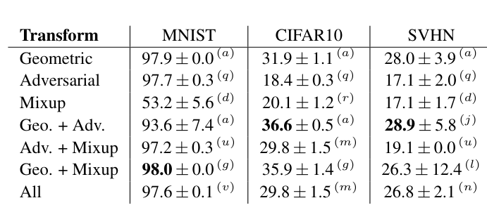

### Information based Deep Clustering: An experimental study

The experimental schedule for WACV revision

Jizong Peng

2019-10-01

----

-  ##### Adding more regularizations.

We have tested on `Geo`, `VAT`, `Mixup` and their combinations. However, we want to add `cutout` and `gaussian` as extra regularization. Therefore, we cannot carry out a grid search on that.

Based on the initial experiments

|                                | MNIST  | CIFAR  | SVHN   |
| ------------------------------ | ------ | ------ | ------ |
| MI(X,Y)+kl(p,T(p)), T=Cutout   | **86** | **20** | **18** |
| MI(X,Y)+kl(p,T(p)), T=Gaussian | 56     | 17     | 17     |
| MI(X,T(X)), T=Cutout           | 36     | 15     | 13     |
| MI(X,T(X)), T=Gaussian         | 58     | 17     | 14     |

In this case, `IMSAT`+`Cutout` reaches best results on three different datasets. See the original paper for the other results. A capture of the screen can be found blow, the `cutout` is equivalent to `mixup` in terms of performance.

So we should focus on the most powerful regularization `cutout`, and to apply it with other powerful regularizations such as `geo` and `vat`. 

Based on this observation, I plan to add such configurations:

1. `MI(X,Y)+kl(p(X),p(T(X))), T=Cutout`
2. `MI(X,Y)+kl(p(X),p(T(X))), T=Gaussian` 
3. `MI(X,Y)+kl(p(X),p(T(X))), T=Cutout+Gaussian `
4. `MI(X,Y)+kl(p(X),p(T(X))), T=Geo+Cutout`
5. `MI(X,Y)+kl(p(X),p(T(X))), T=Geo+Gaussian`
6. `MI(X,Y)+kl(p(X),p(T(X))), T=VAT+Cutout `
7. `MI(X,Y)+kl(p(X),p(T(X))), T=VAT+Gaussian`
8. `MI(X,Y)+kl(p(X),p(T(X))), T=Mixup+Cutout`
9. `MI(X,Y)+kl(p(X),p(T(X))), T=VAT+Mixup+Cutout`
10.  `MI(X,Y)+kl(p(X),p(T(X))), T=Geo+VAT+Mixup+Cutout`

---

1. `MI(X,T(X)), T = Cutout`
2. `MI(X,T(X)), T = Gaussian`
3. `MI(X,T(X)), T = Geo+Cutout`
4. `MI(X,T(X)), T = Geo+Gaussian`

---

1. `MI(X,Geo(X)+kl(p(X)|p(T(X))), T = Cutout`

2. `MI(X,Geo(X)+kl(p(X)|p(T(X))), T = Gaussian`

3. `MI(X,Geo(X)+kl(p(X)|p(T(X))), T = VAT + Cutout`

4. `MI(X,Geo(X)+kl(p(X)|p(T(X))), T = VAT+ Gaussian`

5. `MI(X,Geo(X)+kl(p(X)|p(T(X))), T = Cutout+ Gaussian`

6. `MI(X,Geo(X)+kl(p(X)|p(T(X))), T = Mixup + Cutout`

7. `MI(X,Geo(X)+kl(p(X)|p(T(X))), T = VAT + Mixup+Cutout`

8. `MI(X,Geo(X)+kl(p(X)|p(T(X))), T = Mixup+Gaussian`

   

For all 3 datasets, we have 22 experiments for each and 66 for total. If we consider the random seeds, the experiment number becomes ~200.

---

-  ##### Adding cifar100-20 dataset

I am planning to add cifar100 or cifar100-20 dataset. The computational resources are limited as adding such leading to more than 100 experiments each costing more than 3 days maybe.

---

#### Todo:

1. To verify the code for the 22 configuration is correct. hard to say. I have added  more can 3k lines. 
2. To remove some cases little important based on professor's comments
3. To make sure that cifar100 code works properly.

